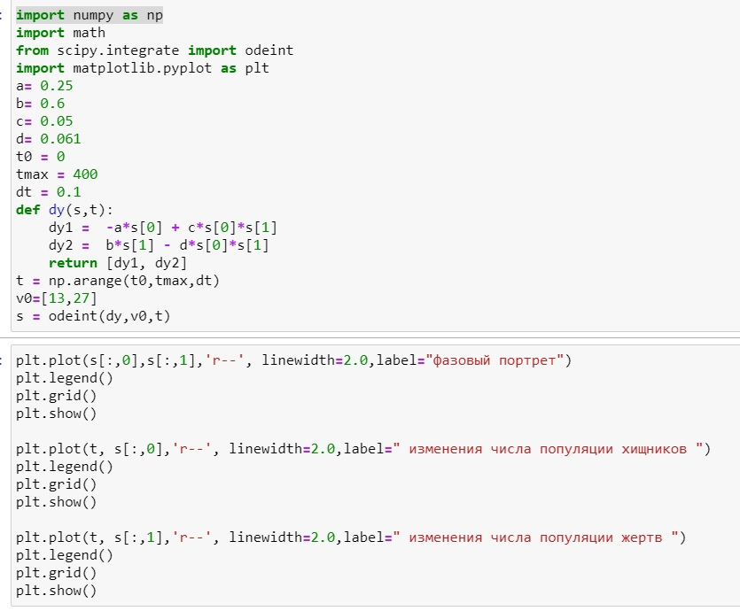
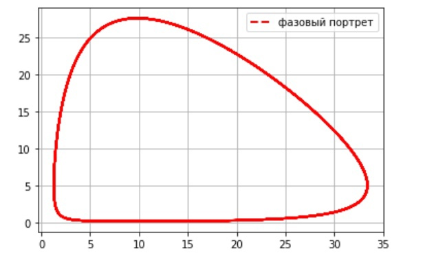
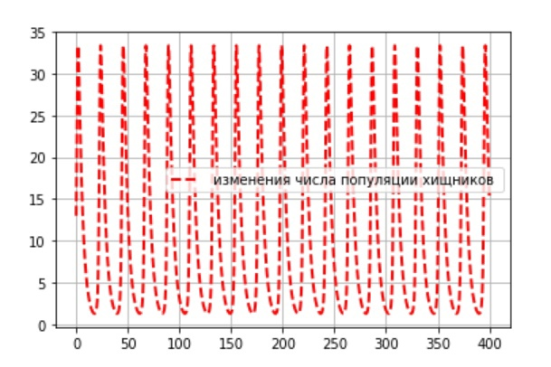
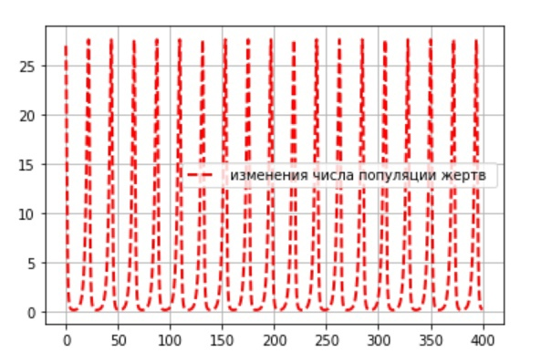
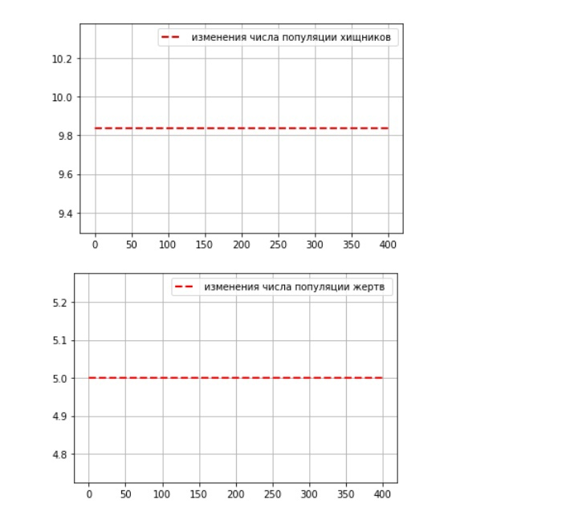

---
## Front matter
lang: ru-RU
title: Модель хищник-жертва
author: Назарьева Алена НФИбд-03-18
institute:
	inst RUDN University, Moscow, Russian Federation
date: 2021, 9 march
## Formatting
toc: false
slide_level: 2
theme: metropolis
header-includes:
 - \metroset{progressbar=frametitle,sectionpage=progressbar,numbering=fraction}
 - '\makeatletter'
 - '\beamer@ignorenonframefalse'
 - '\makeatother'
aspectratio: 43
section-titles: true
---
# Цель работы

Изучить и реализовать Модель хищник-жертва

# Выполнение лабораторной работы

## 1)
Код в python для Модели хищник-жертва  (рис. -@fig:001)

{ #fig:001 width=70% }

## 2)
График зависимости численности хищников от численности жертв (рис. -@fig:002)

{ #fig:002 width=70% }

## 3)
График изменения численности хищников (рис. -@fig:003)

{ #fig:003 width=70% }

## 4)
График изменения численности жертв (рис. -@fig:004)

{ #fig:004 width=70% }

## 5)
Стационарное состояние системы достигается при начальных условиях [9.836065573770492, 5.0]

{ #fig:005 width=70% }

# Выводы

В результате проделанной работы я изучила и реализовала Модель хищник-жертва 
