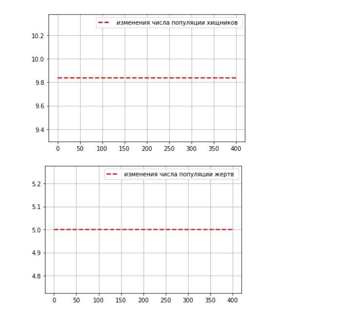

---
# Front matter
lang: ru-RU
title: "Oтчёт по лабораторной работе"
subtitle: "Модель хищник-жертва "
author: "Назарьева Алена Игоревна НФИбд-03-18"

# Formatting
toc-title: "Содержание"
toc: true # Table of contents
toc_depth: 2
lof: true # List of figures
lot: true # List of tables
fontsize: 12pt
linestretch: 1.5
papersize: a4paper
documentclass: scrreprt
polyglossia-lang: russian
polyglossia-otherlangs: english
mainfont: PT Serif
romanfont: PT Serif
sansfont: PT Sans
monofont: PT Mono
mainfontoptions: Ligatures=TeX
romanfontoptions: Ligatures=TeX
sansfontoptions: Ligatures=TeX,Scale=MatchLowercase
monofontoptions: Scale=MatchLowercase
indent: true
pdf-engine: lualatex
header-includes:
  - \linepenalty=10 # the penalty added to the badness of each line within a paragraph (no associated penalty node) Increasing the value makes tex try to have fewer lines in the paragraph.
  - \interlinepenalty=0 # value of the penalty (node) added after each line of a paragraph.
  - \hyphenpenalty=50 # the penalty for line breaking at an automatically inserted hyphen
  - \exhyphenpenalty=50 # the penalty for line breaking at an explicit hyphen
  - \binoppenalty=700 # the penalty for breaking a line at a binary operator
  - \relpenalty=500 # the penalty for breaking a line at a relation
  - \clubpenalty=150 # extra penalty for breaking after first line of a paragraph
  - \widowpenalty=150 # extra penalty for breaking before last line of a paragraph
  - \displaywidowpenalty=50 # extra penalty for breaking before last line before a display math
  - \brokenpenalty=100 # extra penalty for page breaking after a hyphenated line
  - \predisplaypenalty=10000 # penalty for breaking before a display
  - \postdisplaypenalty=0 # penalty for breaking after a display
  - \floatingpenalty = 20000 # penalty for splitting an insertion (can only be split footnote in standard LaTeX)
  - \raggedbottom # or \flushbottom
  - \usepackage{float} # keep figures where there are in the text
  - \floatplacement{figure}{H} # keep figures where there are in the text
---

# Цель работы

Изучить и реализовать Модель хищник-жертва

# Задание

Построить график зависимости численности хищников от численности жертв, а также графики изменения численности хищников и численности жертв при следующих начальных условиях:
x0 = 13, y0 = 27 . Найти стационарное состояние системы.

# Теоретическая справка

Простейшая модель взаимодействия двух видов типа «хищник — жертва» -
модель Лотки-Вольтерры. Данная двувидовая модель основывается на
следующих предположениях:
1. Численность популяции жертв x и хищников y зависят только от времени
(модель не учитывает пространственное распределение популяции на
занимаемой территории)
2. В отсутствии взаимодействия численность видов изменяется по модели
Мальтуса, при этом число жертв увеличивается, а число хищников падает
3. Естественная смертность жертвы и естественная рождаемость хищника
считаются несущественными
4. Эффект насыщения численности обеих популяций не учитывается
5. Скорость роста численности жертв уменьшается пропорционально
численности хищников
dx/dt = ax(t) - bx(t)y(t)
dy/dt = -cy(t)+dx(t)y(t)
(1)
В этой модели x – число жертв, y - число хищников. Коэффициент a
описывает скорость естественного прироста числа жертв в отсутствие хищников, с
- естественное вымирание хищников, лишенных пищи в виде жертв. Вероятность
взаимодействия жертвы и хищника считается пропорциональной как количеству
жертв, так и числу самих хищников (xy). Каждый акт взаимодействия уменьшает
популяцию жертв, но способствует увеличению популяции хищников (члены -bxy
и dxy в правой части уравнения).
Математический анализ этой (жесткой) модели показывает, что имеется
стационарное состояние, всякое же другое начальное состояние
приводит к периодическому колебанию численности как жертв, так и хищников,
так что по прошествии некоторого времени система возвращается в состояние.
Стационарное состояние системы (1) (положение равновесия, не зависящее
от времени решение) будет в точке:
x0 = c/d, y0 = a/b. Если начальные значения задать в стационарном состоянии
x(0) = x0, y(0) = y0, то в любой момент времени
численность популяций изменяться не будет. При малом отклонении от положения
равновесия численности как хищника, так и жертвы с течением времени не
возвращаются к равновесным значениям, а совершают периодические колебания
вокруг стационарной точки. Амплитуда колебаний и их период определяется
начальными значениями численностей x(0), y(0). Колебания совершаются в
противофазе.

# Выполнение лабораторной работы

1. Код в python для Модели хищник-жертва  (рис. -@fig:001)

{ #fig:001 width=70% }

2. График зависимости численности хищников от численности жертв (рис. -@fig:002)

{ #fig:002 width=70% }

3. График изменения численности хищников (рис. -@fig:003)

{ #fig:003 width=70% }

4. График изменения численности жертв (рис. -@fig:004)

{ #fig:004 width=70% }

5. Стационарное состояние системы достигается при начальных условиях [9.836065573770492, 5.0]

{ #fig:005 width=70% }

# Выводы

В результате проделанной работы я изучила и реализовала Модель хищник-жертва 
